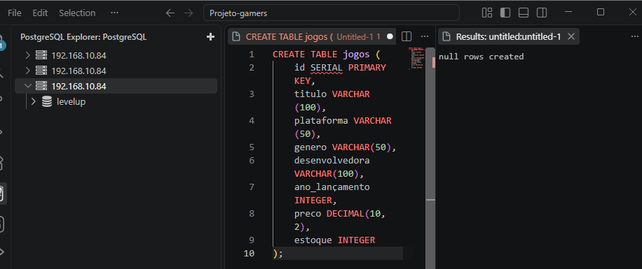
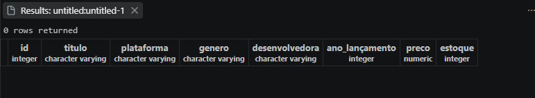
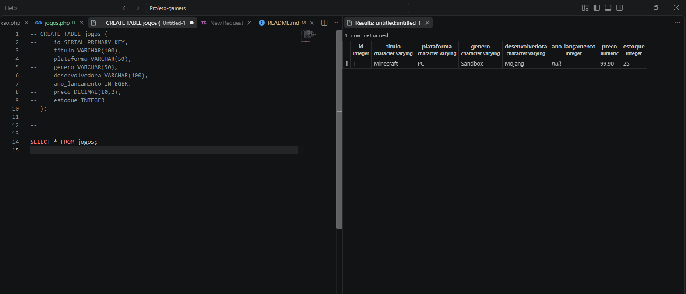
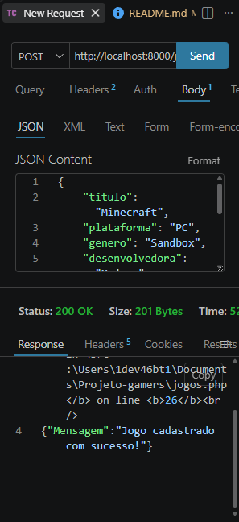
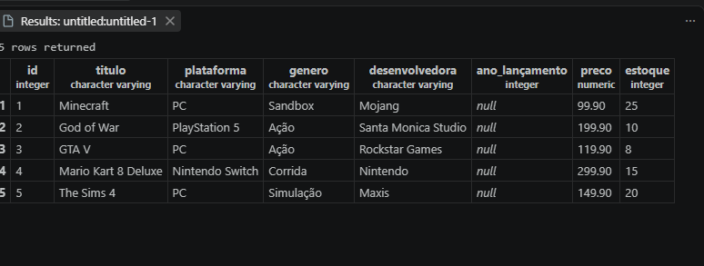
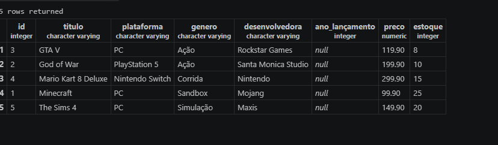
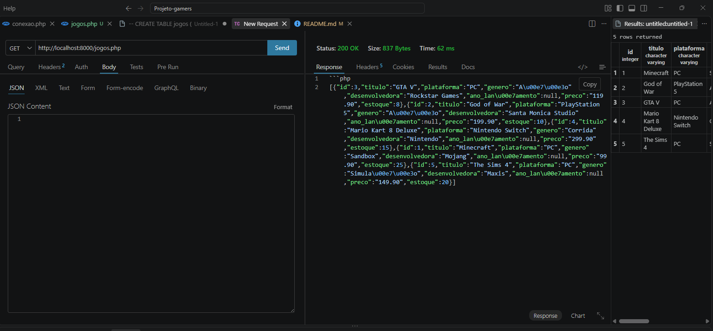

## Atividade - API de Catálogo de Games.

Esse projeto foi feito para criar uma **API de catálogo de games**, usando **PHP e PostgreSQL**.

A API permite cadastrar jogos no banco de dados e depois consultar todos os jogos que foram cadastrados.

#### Banco de Dados

Primeiro foi criado o banco de dados chamado: `levelup`

Depois, dentro desse banco, foi criada a tabela `jogos`.

A tabela foi feita para guardar as principais informações de cada jogo:

| Campo | Tipo |
|---|---|
| `id` | SERIAL |
| `titulo` | VARCHAR |
| `plataforma` | VARCHAR |
| `genero` | VARCHAR |
| `desenvolvedora` | VARCHAR |
| `ano_lancamento` | INTEGER |
| `preco` | DECIMAL |
| `estoque` | INTEGER |

#### O que cada campo guarda?

- **id:** identifica cada jogo.
- **titulo:** nome do jogo.
- **plataforma:** onde o jogo pode ser jogado.
- **genero:** tipo de jogo, como ação, corrida ou simulação.
- **desenvolvedora:** empresa que desenvolveu o jogo.
- **ano_lancamento:** ano em que o jogo foi lançado.
- **preco:** preço do jogo.
- **estoque:** quantidade de jogos disponíveis.

## Criação da tabela

Usei o seguinte comando SQL para criar a tabela:

Nesse primeiro print aparece o momento em que a tabela `jogos` foi criada no banco de dados.

Depois de criar a tabela, foi possível conferir os campos que foram adicionados e verificar se estava tudo certo.

---

## Conexão com o banco

No arquivo `conexao.php` foi feita a conexão do PHP com o banco de dados `levelup`.

Essa conexão é necessária para que a API consiga enviar e receber informações do banco.

A conexão foi feita utilizando o **PDO**.

---

## Cadastro dos Jogos - POST

Para cadastrar os jogos foi utilizado o método POST.

No Thunder Client, foi enviado um JSON com as informações do jogo. Por exemplo:

Depois de enviar os dados, eles são armazenados na tabela jogos.

Quando o cadastro é realizado, a API retorna uma mensagem confirmando que deu certo.

{
    "Mensagem": "Jogo cadastrado com sucesso!"
}

---

## Jogos Cadastrados

Depois de testar o cadastro, foram adicionados 5 jogos ao banco de dados.

Assim foi possível conferir se todos os dados estavam sendo armazenados corretamente na tabela.

Nesse print aparecem os jogos que foram cadastrados e as informações de cada um deles.

---

## Consulta dos Jogos - GET
Depois do cadastro, foi utilizado o método **GET** para consultar os jogos que estavam salvos no banco.

A consulta utilizada foi:

SELECT * FROM jogos ORDER BY titulo;

O `ORDER BY titulo` foi usado para que os jogos aparecessem **em ordem alfabética pelo título**.

 

Nesse print aparece o teste realizado pelo Thunder Client utilizando o método GET.

 

Nesse print aparece o resultado retornado pela API, com os jogos em ordem alfabética.

---

##  Conclusão

Nesse projeto, foi criada uma API de catálogo de games usando **PHP e PostgreSQL**.

Foi possível cadastrar os jogos usando o **POST** e consultar os jogos usando o **GET**. Também foram feitos testes com os jogos cadastrados e a consulta foi organizada em **ordem alfabética**. 

